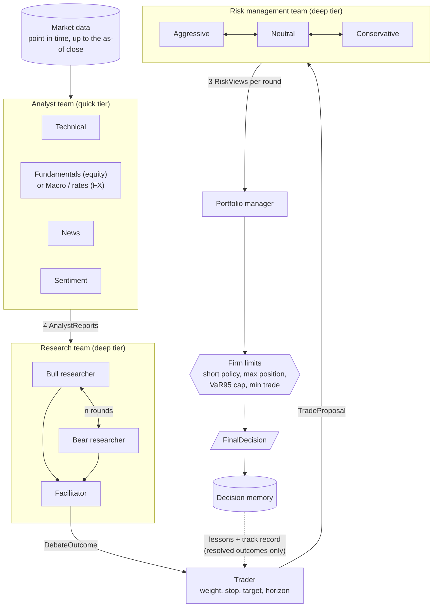
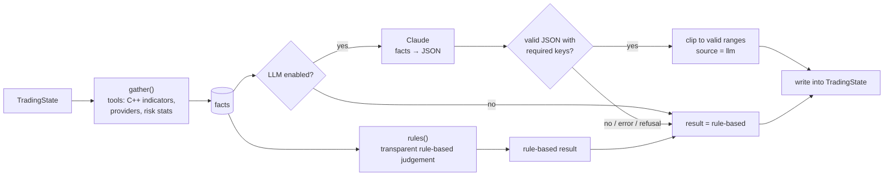
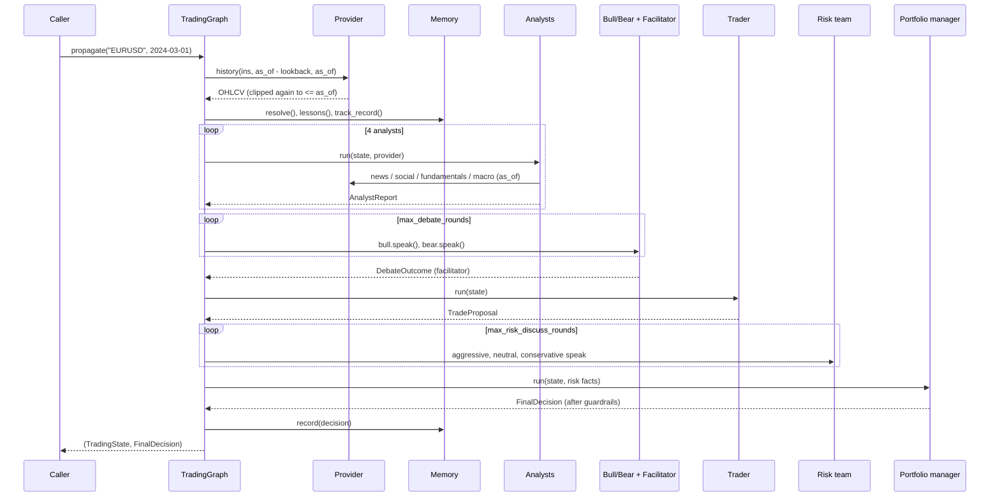
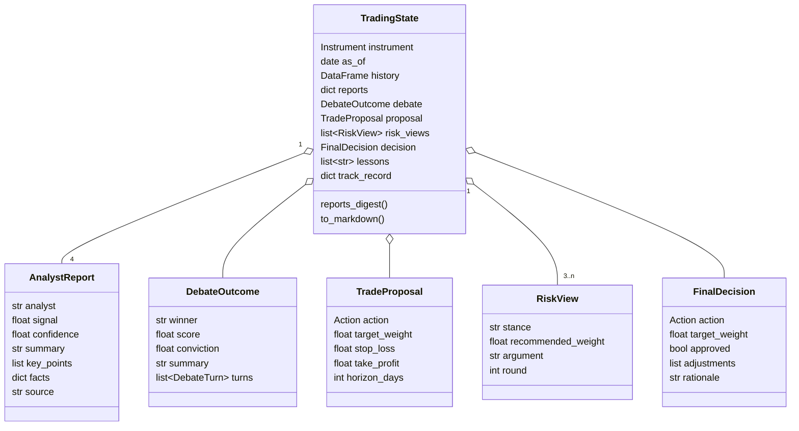
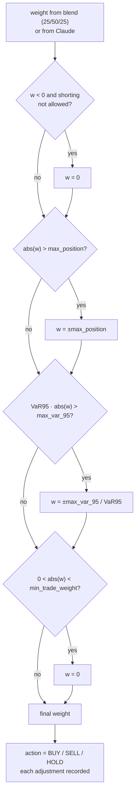
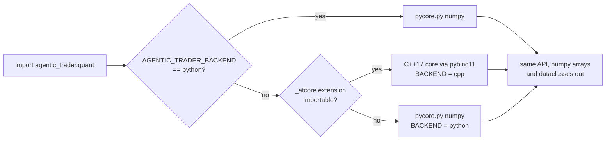
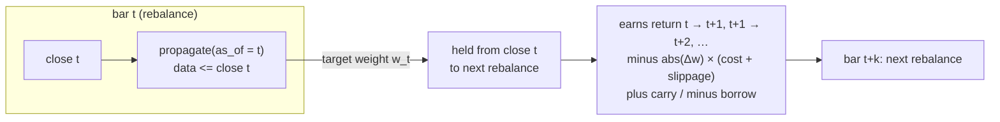
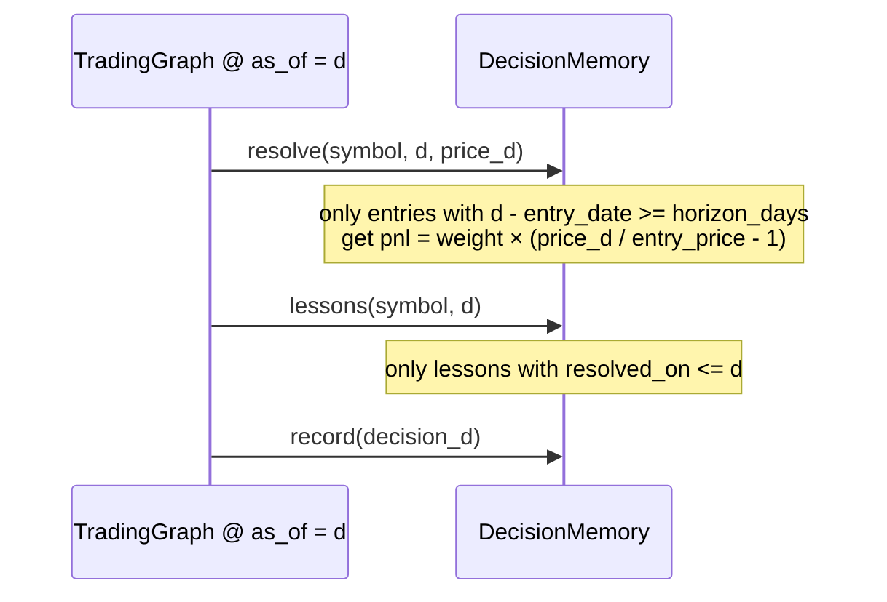
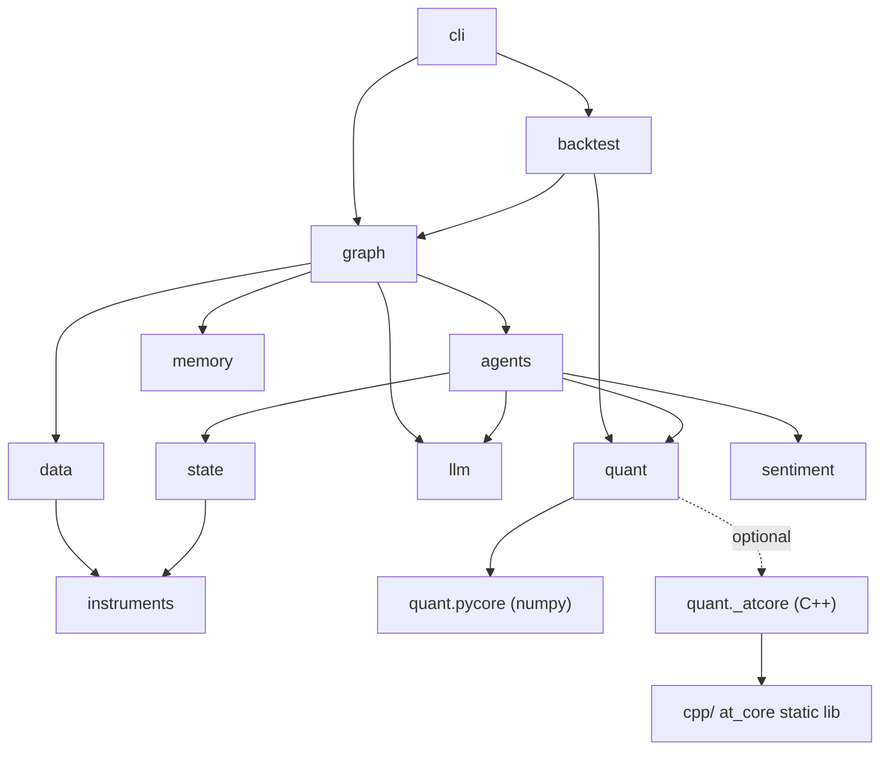
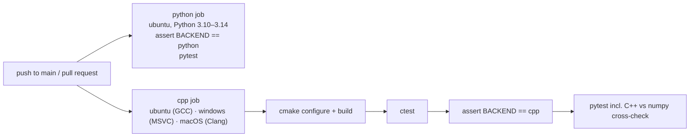

# Diagrams

These Mermaid diagrams render natively on github.com. The prose explanation is in
[architecture/overview.md](architecture/overview.md).

1. [Decision pipeline](#1-decision-pipeline)
2. [Agent pattern: tools, then rules, then LLM](#2-agent-pattern-tools-then-rules-then-llm)
3. [Sequence of one `propagate()` call](#3-sequence-of-one-propagate-call)
4. [Structured state](#4-structured-state)
5. [Portfolio-manager guardrails](#5-portfolio-manager-guardrails)
6. [Quant backend selection](#6-quant-backend-selection)
7. [Walk-forward backtest timing](#7-walk-forward-backtest-timing)
8. [Memory without look-ahead](#8-memory-without-look-ahead)
9. [Package dependencies](#9-package-dependencies)
10. [CI matrix](#10-ci-matrix)

## 1. Decision pipeline

## 2. Agent pattern: tools, then rules, then LLM

## 3. Sequence of one `propagate()` call

## 4. Structured state

## 5. Portfolio-manager guardrails

## 6. Quant backend selection

## 7. Walk-forward backtest timing

## 8. Memory without look-ahead

## 9. Package dependencies

## 10. CI matrix

